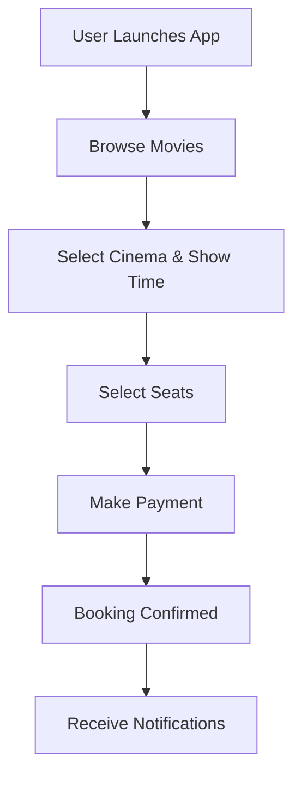
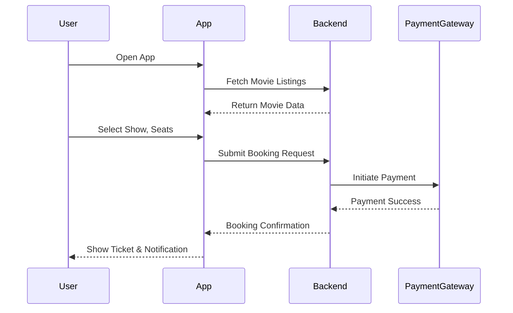
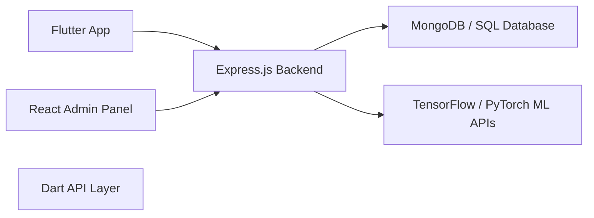

---

# 🎬 Cinemas and Booking Ticket Flutter App

## 📱 Overview

The **Cinemas and Booking Ticket Flutter App** is a cross-platform mobile application designed to enhance the moviegoing experience. Built using the **Flutter** framework, it provides users with intuitive features such as movie exploration, real-time seat booking, cinema locating, and secure payment — all in one place.

---

## 🚀 Features

1. **🎥 Movie Listings**
   Browse movies with details like title, genre, synopsis, and release date.

2. **📍 Cinema Locator**
   Find nearby cinemas based on GPS or search manually.

3. **⏱️ Showtimes and Schedules**
   View schedules and plan your viewing accordingly.

4. **🪑 Seat Selection**
   Choose your seats with an interactive layout.

5. **💳 Booking and Payment**
   Seamlessly book and pay using multiple methods.

6. **👤 User Profiles**
   Manage bookings, preferences, and past activity.

7. **🔔 Notifications**
   Get reminders, confirmations, and promotional offers.

---

## 🛠️ Installation

1. Make sure you have [Flutter](https://flutter.dev/docs/get-started/install) installed.

2. Clone this repository:

   ```bash
   git clone https://github.com/jayanth119/AtoZCinemas
   cd atoz_cinemas
   ```

3. Install the dependencies:

   ```bash
   flutter pub get
   ```

4. Run the app:

   ```bash
   flutter run
   ```

---

## 🧩 Dependencies

* [`flutter_bloc`](https://pub.dev/packages/flutter_bloc) – State management
* [`dio`](https://pub.dev/packages/dio) – Network requests
* [`provider`](https://pub.dev/packages/provider) – Dependency injection and state

---

## 🧠 System Architecture (Mermaid Diagrams)

### ▶️ Flowchart – Booking Flow



---

### 🔄 Sequence Diagram – End-to-End Booking



---

### 🧱 Component Diagram – Tech Stack



---

## 📱 Output Screenshots

### Mobile


### Web


### Desktop


---

## 🤝 Contributing

1. Fork the repo
2. Create a feature branch
3. Commit your changes
4. Push and submit a PR

Please ensure your contributions follow the coding conventions and are well-documented.

---

## 📜 License

This project is licensed under the MIT License. See the [LICENSE](LICENSE) file for details.

---

Happy Coding! 🎬🍿
*Made with ❤️ by Jayanth*

---
